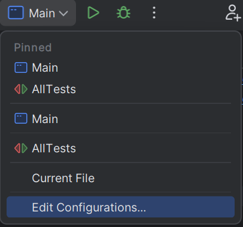

# Анализатор логов

# Как пользоваться?

В IDEA открываем настройки конфигурации

Вот тут можно написать аргументы командной строки, после этого запускаем проект.

Если аргумент `--path` отсутствует, увидим ошибку

Если аргументом `--path` является не путь к локальным файлам или к файлу в интернете, увидим ошибку

Если аргументы `--from` и `--to` не в формате `YYYY-MM-DD`, увидим ошибку

Если аргументом `--format` является не `markdown` или `adoc`, увидим ошибку

Если указан только один из аргументов `--filter-field` и `--filter-value`, увидим ошибку

Если аргументом `--filter-field` указано поле, которого нет в логах, увидим ошибку

Если аргумент `--output` содержит `*` , увидим ошибку

Если аргумент `--output` не является локальным путем, увидим ошибку

Если аргумент `--output` ведет к файлу, который нельзя создать или открыть, увидим ошибку

Далее, если ошибок нет, программа проанализирует указанные логи и выведет их в формате

- `markdown` или `adoc`, если он указан соответствующим аргументом командной строки
- `plain text`, если аргумент не указан

  

и

- в консоль, если не указан аргумент `--output`
- в файл, указанный аргументом `--output`

Метрики, которые считают количество запросов по какому-то признаку, выводят не более 5 с самым большим количеством записей.

# Что происходит внутри?

1. Парсинг аргументов командной строки
2. Валидация этих аргументов
3. Получение `Stream` записей с логами
4. Собираем статистики по этим логам
5. Печатаем собранные статистики
